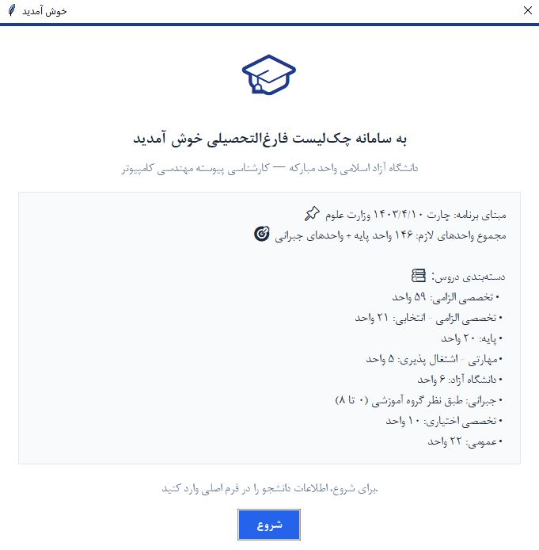
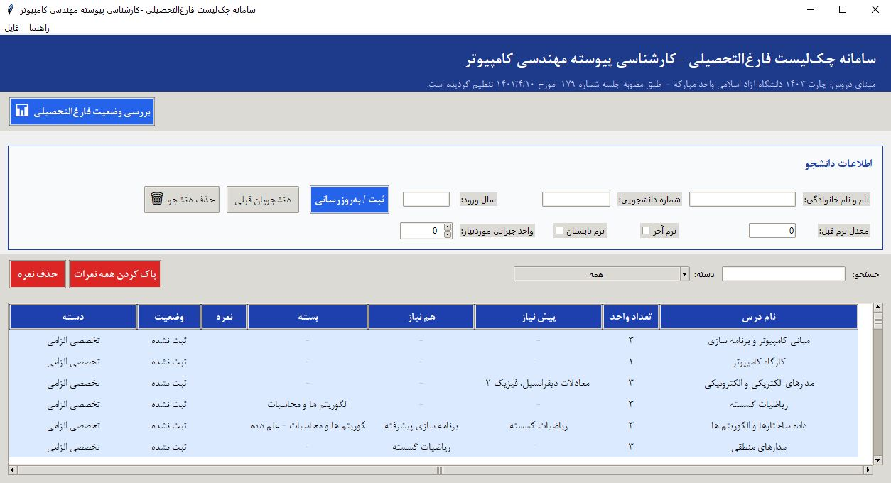
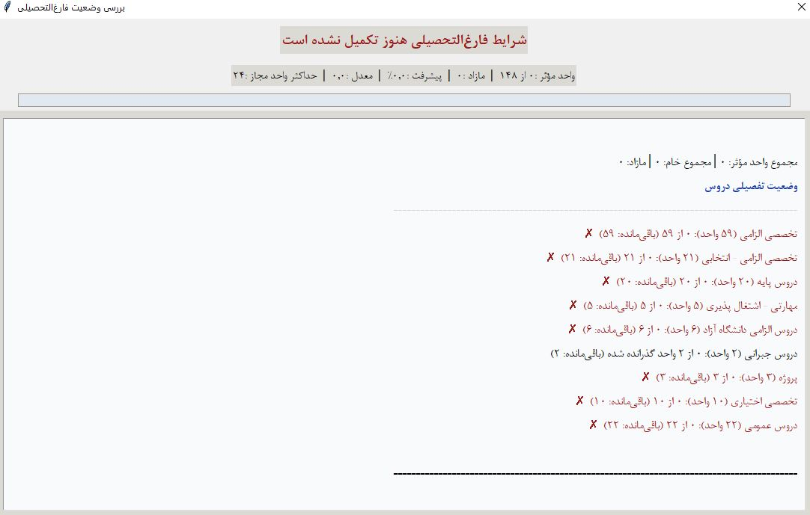

# 🎓 سامانه چک‌لیست فارغ‌التحصیلی مهندسی کامپیوتر

یک برنامه دسکتاپ برای ثبت سوابق درسی دانشجو و بررسی خودکار وضعیت فارغ‌التحصیلی در مقطع کارشناسی پیوسته مهندسی کامپیوتر، ساخته‌شده با Python و Tkinter.

این سامانه با استفاده از اطلاعات دانشجو، نمرات ثبت‌شده، دسته‌بندی دروس، پیش‌نیازها، هم‌نیازها، دروس جایگزین و برخی قواعد مربوط به انتخاب واحد، وضعیت تحصیلی را محاسبه و موارد باقی‌مانده یا مشکل‌دار را نمایش می‌دهد.

## ✨ امکانات

### 👨‍🎓 مدیریت دانشجو
- ثبت اطلاعات دانشجو شامل:
  - نام و نام خانوادگی
  - شماره دانشجویی
  - سال ورود
  - معدل ترم قبل
  - وضعیت ترم آخر
  - وضعیت ترم تابستان
  - تعداد واحد جبرانی موردنیاز
- به‌روزرسانی اطلاعات دانشجوی موجود بر اساس شماره دانشجویی
- انتخاب دانشجویان قبلی
- حذف دانشجو

### 📚 مدیریت دروس و نمرات
- نمایش دروس چارت 1403 در جدول
- نمایش کد، نام درس، تعداد واحد، دسته، بسته، پیش‌نیاز و هم‌نیاز
- ثبت یا ویرایش نمره با دوبار کلیک روی درس
- حذف نمره یک درس
- حذف تمام نمرات دانشجو
- جستجوی سریع دروس
- فیلتر کردن دروس بر اساس دسته
- نمایش رنگی وضعیت دروس و دسته‌های مختلف

### 📊 بررسی وضعیت فارغ‌التحصیلی
- محاسبه تعداد واحدهای گذرانده‌شده
- محاسبه معدل بر اساس نمرات ثبت‌شده
- محاسبه درصد پیشرفت تحصیلی
- نمایش حداکثر واحد مجاز بر اساس شرایط دانشجو
- بررسی کامل دسته‌های مختلف دروس
- نمایش واحدهای باقی‌مانده
- شناسایی دروس مردود
- شناسایی دروس مازاد بر سقف هر دسته
- نمایش هشدارهای پیش‌نیاز و هم‌نیاز
- بررسی شرط گذراندن حداقل 100 واحد برای دروس مشخص‌شده
- بررسی شرط وجود حداقل یک واحد آزمایشگاه یا کارگاه در 10 واحد تخصصی اختیاری
- مدیریت گروه‌های دروس عمومی جایگزین
- ارائه فهرست هوشمند دروس باقی‌مانده
- اعلام نتیجه نهایی وضعیت فارغ‌التحصیلی

### 💾 پشتیبان‌گیری و بازیابی
- تهیه نسخه پشتیبان از پایگاه داده
- بازیابی پایگاه داده از فایل پشتیبان
- استفاده از SQLite به‌صورت فایل محلی

### 🖥️ رابط کاربری
- رابط گرافیکی دسکتاپ با Tkinter
- پشتیبانی از نمایش راست‌به‌چپ برای محتوای فارسی
- جدول Treeview برای نمایش دروس
- نوار پیشرفت تحصیلی
- پنجره اختصاصی برای بررسی وضعیت فارغ‌التحصیلی
- پنجره راهنما و درباره برنامه
- طراحی واکنش‌گرا نسبت به اندازه صفحه نمایش

## 🛠️ فناوری‌ها

- Python
- Tkinter / ttk – رابط گرافیکی
- SQLite3 – پایگاه داده رابطه‌ای محلی
- `dataclasses` – مدل‌سازی ساختار درس
- `datetime` – مدیریت تاریخ و زمان
- `shutil` – پشتیبان‌گیری و بازیابی
- کتابخانه‌های استاندارد Python

این پروژه برای اجرای پایه، به نصب کتابخانه‌های خارجی Python نیاز ندارد.

## 📋 پیش‌نیازها

- Python 3.7 یا بالاتر
- Tkinter

> در بسیاری از نصب‌های Python برای Windows، Tkinter به‌صورت پیش‌فرض همراه Python نصب می‌شود.

## 🚀 نصب و اجرا

### 1. دریافت پروژه

فایل اصلی پروژه را در یک پوشه قرار دهید:

```text
Checklist.py
```

### 2. اجرای برنامه

در Windows می‌توانید در پوشه پروژه Command Prompt یا PowerShell را باز کرده و اجرا کنید:

```bash
python "Checklist.py"
```

یا در صورت استفاده از Python Launcher:

```bash
py "Checklist.py"
```

### 3. ایجاد پایگاه داده

در اولین اجرای برنامه، فایل زیر به‌صورت خودکار ایجاد می‌شود:

```text
graduation_checklist.db
```

ساختار جداول و اطلاعات اولیه دروس نیز توسط برنامه ایجاد و در پایگاه داده ثبت می‌شود.

## 🎯 قواعد اصلی برنامه

مبنای دروس و دسته‌بندی‌های این نسخه، چارت 1403 دانشگاه آزاد اسلامی واحد مبارکه و اطلاعات درج‌شده در خود برنامه است.

دسته‌های اصلی دروس عبارت‌اند از:

| دسته | واحد موردنیاز |
|---|---:|
| تخصصی الزامی | 59 |
| تخصصی الزامی - انتخابی | 21 |
| پایه | 20 |
| مهارتی - اشتغال پذیری | 5 |
| دانشگاه آزاد | 6 |
| جبرانی | طبق نیاز دانشجو، حداکثر 8 |
| پروژه | 3 |
| تخصصی اختیاری | 10 |
| عمومی | 22 |

مجموع اصلی چارت در برنامه برابر با **148 واحد** در نظر گرفته شده است. در صورتی که دانشجو به واحدهای جبرانی نیاز نداشته باشد، تعداد واحد مؤثر موردنیاز می‌تواند کمتر باشد.

> این README صرفاً مستندات نرم‌افزار و منطق پیاده‌سازی‌شده در کد است و جایگزین بررسی رسمی چارت و مقررات آموزشی دانشگاه نیست.

## 🧮 منطق محاسبه وضعیت تحصیلی

### نمره قبولی

در منطق فعلی برنامه:

```text
نمره >= 10  → قبول
نمره < 10   → مردود
```

### حداکثر واحد مجاز

برنامه حداکثر واحد مجاز را بر اساس وضعیت دانشجو محاسبه می‌کند:

| وضعیت | حداکثر واحد |
|---|---:|
| معدل ≤ 12 | 14 |
| معدل > 12 | 20 |
| معدل > 17 | 24 |
| ترم آخر | 24 |
| ترم تابستان | 8 |

در صورت قرار گرفتن دانشجو در چند وضعیت، اولویت منطق برنامه مطابق ترتیب پیاده‌سازی در کد اعمال می‌شود.

### پیش‌نیاز و هم‌نیاز

برای درس‌هایی که پیش‌نیاز یا هم‌نیاز دارند، برنامه وضعیت گذراندن درس مربوطه را بررسی کرده و در صورت وجود مشکل، هشدار نمایش می‌دهد.

### شرط 100 واحد

برخی دروس مشخص‌شده در برنامه، از جمله پروژه و کارآموزی، نیازمند گذراندن حداقل **100 واحد از دروس دیگر** هستند.

### دروس تخصصی اختیاری

برای تکمیل 10 واحد تخصصی اختیاری، برنامه بررسی می‌کند که حداقل **1 واحد آزمایشگاه یا کارگاه** از این دسته گذرانده شده باشد.

### دروس عمومی جایگزین

برخی دروس عمومی در گروه‌های جایگزین قرار گرفته‌اند. از هر گروه جایگزین، فقط یک درس در محاسبه واحدهای موردنیاز عمومی لحاظ می‌شود و در صورت گذراندن چند گزینه از یک گروه، موارد اضافه به‌عنوان مازاد گزارش می‌شوند.

## 🗃️ ساختار پایگاه داده

برنامه از SQLite استفاده می‌کند و سه جدول اصلی دارد:

### `students`

اطلاعات دانشجویان را نگهداری می‌کند:

- `id`
- `student_no`
- `name`
- `entry_year`
- `current_gpa`
- `is_last_semester`
- `is_summer`
- `needs_compensatory`
- `compensatory_units`

### `courses`

اطلاعات دروس چارت را نگهداری می‌کند:

- `code`
- `name`
- `units`
- `category`
- `prerequisite`
- `co_requisite`
- `package`
- `lab_or_workshop`
- `alt_group`

### `grades`

نمرات هر دانشجو را نگهداری می‌کند:

- `id`
- `student_id`
- `course_code`
- `grade`

برای هر دانشجو و هر درس، فقط یک رکورد نمره مجاز است.

## 🔄 پشتیبان‌گیری و بازیابی

از منوی:

```text
فایل → پشتیبان‌گیری از دیتابیس
```

می‌توان یک نسخه از فایل پایگاه داده ذخیره کرد.

برای بازیابی:

```text
فایل → بازیابی از پشتیبان
```

استفاده کنید.

> بازیابی پشتیبان، اطلاعات فعلی فایل دیتابیس را با نسخه انتخاب‌شده جایگزین می‌کند. پس بهتر است قبل از بازیابی، از اطلاعات فعلی نیز نسخه پشتیبان تهیه شود.

## 🧑‍💻 نحوه استفاده

### 1. ثبت دانشجو

در بخش «اطلاعات دانشجو»:

- نام و نام خانوادگی را وارد کنید.
- شماره دانشجویی را وارد کنید.
- در صورت نیاز سال ورود را وارد کنید.
- معدل ترم قبل را وارد کنید.
- در صورت لزوم گزینه «ترم آخر» یا «ترم تابستان» را فعال کنید.
- تعداد واحد جبرانی موردنیاز را مشخص کنید.
- روی «ثبت / به‌روزرسانی» کلیک کنید.

### 2. ثبت نمرات

برای ثبت یا ویرایش نمره، روی ردیف درس **دوبار کلیک** کنید.

در پنجره بازشده، نمره‌ای بین 0 تا 20 وارد کرده و ذخیره کنید.

خالی گذاشتن فیلد نمره، نمره ثبت‌شده آن درس را حذف می‌کند.

### 3. بررسی وضعیت فارغ‌التحصیلی

پس از ثبت نمرات، روی:

```text
📊 بررسی وضعیت فارغ‌التحصیلی
```

کلیک کنید.

برنامه گزارشی شامل موارد زیر نمایش می‌دهد:

- مجموع واحد مؤثر
- مجموع واحد خام
- واحدهای مازاد
- درصد پیشرفت
- معدل
- حداکثر واحد مجاز
- وضعیت هر دسته
- دروس مردود
- هشدارهای پیش‌نیاز و هم‌نیاز
- مشکلات باقی‌مانده
- دروس باقی‌مانده


فایل `graduation_checklist.db` پس از اجرای برنامه ایجاد می‌شود و در صورت نیاز می‌توان از آن نسخه پشتیبان تهیه کرد.

## ⚠️ نکات مهم

- اطلاعات دروس و قواعد موجود در این نسخه از داده‌های تعریف‌شده داخل کد برنامه خوانده می‌شوند.
- تغییر چارت یا مقررات آموزشی نیازمند به‌روزرسانی داده‌ها و منطق برنامه است.
- برنامه وضعیت فارغ‌التحصیلی را بر اساس قواعدی که در کد پیاده‌سازی شده‌اند محاسبه می‌کند.
- هشدارهای پیش‌نیاز و هم‌نیاز باید در صورت وجود ابهام، با چارت رسمی و مقررات آموزشی تطبیق داده شوند.
- فایل دیتابیس حاوی اطلاعات دانشجو و نمرات است؛ بنابراین نگهداری و اشتراک‌گذاری آن باید با دقت انجام شود.

## 📄 وضعیت مجوز

MIT LICENSE

## 🤝 مشارکت در توسعه

برای توسعه نسخه‌های بعدی می‌توان امکاناتی مانند موارد زیر را اضافه کرد:

- خروجی PDF از گزارش فارغ‌التحصیلی
- خروجی Excel از سوابق درسی
- امکان تعریف چند چارت آموزشی
- امکان ویرایش چارت بدون تغییر مستقیم کد
- مدیریت چند دانشجو و گزارش‌گیری گروهی
- نمایش نمودار پیشرفت تحصیلی
- سیستم احراز هویت کاربران
- ثبت تاریخچه تغییرات نمرات
- امکان وارد کردن اطلاعات از فایل Excel
- بسته‌بندی برنامه به‌صورت فایل اجرایی Windows (`.exe`)

## 📸 Screenshots





### 📌 نسخه

**Version:** 1.0.0

**Application:** سامانه چک‌لیست فارغ‌التحصیلی - کارشناسی پیوسته مهندسی کامپیوتر

**Technology:** Python + Tkinter + SQLite

**Chart Basis:** چارت 1403 دانشگاه آزاد اسلامی واحد مبارکه
